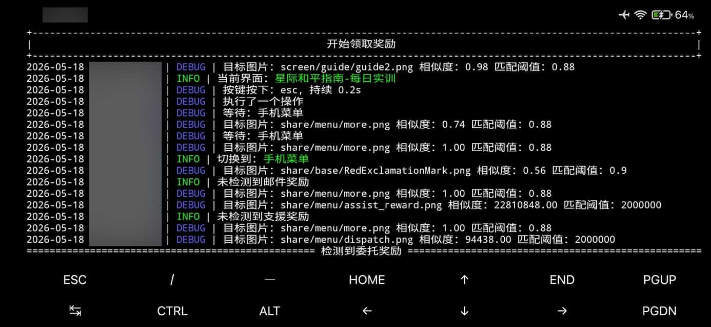

# Termux 安卓部署教程

本教程介绍如何在安卓设备上通过 Termux + proot-distro 运行 March7th Assistant（云崩铁模式）。

> **注意**：
> - 本教程**仅支持云游戏模式**，不支持本地游戏客户端。
> - 本方式**不是很推荐**日常使用，仅适合有兴趣折腾的用户尝试。
> - 操作需要你有一定的 **Linux 基础**，遇到问题时需要具备基本的排错能力。

## 前置要求

- 安卓设备内存 2G 以上（建议 4G+）
- 稳定的网络连接
- 基本的 Linux 命令行知识

## 1. 安装 Termux

前往 Termux 的 GitHub Releases 页面下载安装包：

> <https://github.com/termux/termux-app/releases/latest>

根据自己的安卓设备架构选择对应的安装包：

| 后缀 | 架构 | 说明 |
|------|------|------|
| `arm64-v8a` | ARM 64 位 | **新款手机基本都是这个架构**，搞不懂就选这个 |
| `x86_64` | x86 64 位 | 模拟器或少数平板 |
| `universal` | 通用 | 兼容所有架构，体积较大，实在搞不懂就选这个 |

> **注意**：**不支持** `armeabi-v7a`（32 位 ARM）架构，本项目所需的依赖项无法在该架构上安装。

> **注意**：请从 GitHub Releases 下载 APK 手动安装，**不要**从 Google Play 安装旧版本。

---

## 方式一：proot-distro v5.0 镜像部署（推荐）

proot-distro v5.0 支持直接拉取 Docker 镜像，无需手动安装依赖，一条命令即可部署。

> **注意**：需要 proot-distro **5.0+** 版本。安装后可通过 `proot-distro --help` 检查版本。

### 2. 安装 proot-distro 并配置 Termux

首先切换到国内镜像源以加速后续下载：

```bash
termux-change-repo
```

在弹出的界面中选择 **Mirror group**，然后选择 **Mirrors in Chinese Mainland**（国内镜像）。

```bash
pkg install proot-distro
```

建议获取唤醒锁，防止安装过程中设备休眠导致 Termux 被系统杀掉：

```bash
termux-wake-lock
```

### 3. 创建项目目录并下载配置文件

```bash
mkdir -p march7thassistant/logs march7thassistant/3rdparty/WebBrowser/UserProfile
cd march7thassistant
curl -o config.yaml https://m7a.top/assets/config/config.example.yaml
```

### 4. 下载启动脚本

```bash
curl -o start-m7a.sh https://m7a.top/assets/scripts/start-m7a.sh
chmod +x start-m7a.sh
```

### 5. 首次启动

首次需要拉取镜像（可能较慢）：

```bash
proot-distro install ghcr.io/moesnow/march7thassistant:latest
```

> **中国大陆用户**：如果下载速度较慢，可以使用南京大学镜像源：
>
> ```bash
> proot-distro install ghcr.nju.edu.cn/moesnow/march7thassistant:latest
> ```

之后启动程序：

```bash
./start-m7a.sh
```

首次运行时，程序会自动进入**二维码登录**模式。

二维码图片会保存在 `logs/qrcode_login.png`，使用手机**米游社 APP** 扫描完成登录。

也可以查看终端输出中的二维码内容，使用在线工具（如 [草料二维码](https://cli.im/)）将网址生成二维码后扫码登录。

如果一切顺利，你应该能够在安卓设备上成功运行 March7th Assistant 了！



### 如何更新

```bash
proot-distro reset march7thassistant
```

### 循环运行

默认情况下，启动脚本在任务完成后会自动退出。如果需要循环运行（例如每天定时执行），编辑 `start-m7a.sh`，将 `MARCH7TH_AFTER_FINISH=Exit` 改为 `MARCH7TH_AFTER_FINISH=Loop`。

### 启动非完整运行任务

默认情况下运行的是**完整运行**，如果只想执行某个子任务，编辑 `start-m7a.sh`，取消注释末尾的 `-- python main.py daily` 并修改为所需任务名，同时在上一行 `MARCH7TH_LOG_LEVEL=DEBUG` 末尾添加 `\`：

```bash
  --env MARCH7TH_LOG_LEVEL=DEBUG \
  -- python main.py daily
```

常见示例：

| 任务名 | 说明 |
|------|------|
| `daily` | 仅执行每日实训 |
| `power` | 仅执行清体力 |
| `currencywars` | 仅执行货币战争 |
| `divergent` | 仅执行差分宇宙 |
| `notify` | 测试消息推送 |
| `-l` | 查看完整任务列表 |

---

## 方式二：传统手动安装

如果你使用的 proot-distro 版本低于 5.0，或希望更灵活地控制环境，可以使用以下手动安装方式。

### 2. 配置 Termux

安装完成后打开 Termux，首先切换到国内镜像源以加速后续下载：

```bash
termux-change-repo
```

在弹出的界面中选择 **Mirror group**，然后选择 **Mirrors in Chinese Mainland**（国内镜像）。

建议获取唤醒锁，防止安装过程中设备休眠导致 Termux 被系统杀掉：

```bash
termux-wake-lock
```

### 3. 安装 proot-distro 并部署 Debian

```bash
pkg install proot-distro
proot-distro install debian
```

> **注意**：`proot-distro install debian` 没有使用国内镜像，如果下载速度很慢或连接失败，可以尝试通过代理下载，或自行搜索 proot-distro 的镜像源配置方法。

### 4. 进入 Debian 容器

```bash
proot-distro login debian
```

进入后，配置国内镜像源（这里使用阿里云为例）：

```bash
# Debian 11 及更早版本
sed -i 's/deb.debian.org/mirrors.aliyun.com/g' /etc/apt/sources.list

# Debian 12 及更新版本
sed -i 's/deb.debian.org/mirrors.aliyun.com/g' /etc/apt/sources.list.d/debian.sources
```

> 不确定用哪个？可以两个都执行，不存在的文件会被自动跳过。

更新系统并配置时区：

```bash
apt update && apt upgrade -y
apt install -y tzdata && ln -sf /usr/share/zoneinfo/Asia/Shanghai /etc/localtime
```

### 5. 安装依赖

安装 Python、Chromium 浏览器及驱动等必要软件包：

```bash
apt install -y python3 python3-pip pipx git chromium chromium-driver
```

配置 pip 国内镜像源：

```bash
python3 -m pip config set global.index-url https://mirrors.aliyun.com/pypi/simple/
```

安装 uv（Python 包管理工具）：

```bash
pipx install uv
pipx ensurepath
```

> **注意**：执行 `pipx ensurepath` 后，需要输入 `exit` 退出 Debian 容器，然后重新进入以使环境变量生效：
>
> ```bash
> exit
> proot-distro login debian
> ```

### 6. 克隆项目并安装依赖

```bash
git clone https://github.com/moesnow/March7thAssistant --depth 1
cd March7thAssistant
uv sync --only-group docker
```

> **注意**：克隆仓库需要访问 GitHub，如果遇到网络问题，可以尝试通过代理下载，或使用 GitHub 镜像站。

### 7. 配置环境变量

```bash
export MARCH7TH_CLOUD_GAME_ENABLE=true
export MARCH7TH_BROWSER_HEADLESS_ENABLE=true
export MARCH7TH_BROWSER_HEADLESS_RESTART_ON_NOT_LOGGED_IN=false
export MARCH7TH_DOCKER_STARTED=true
export MARCH7TH_LOG_LEVEL=DEBUG
export MARCH7TH_BROWSER_TYPE=chromium
export MARCH7TH_BROWSER_PATH=/usr/bin/chromium
export MARCH7TH_DRIVER_PATH=/usr/bin/chromedriver
```

> **提示**：每次进入 Debian 容器后都需要重新设置这些环境变量。可以将上述 `export` 命令写入 `~/.bashrc` 文件以实现自动加载：
>
> ```bash
> cat >> ~/.bashrc << 'EOF'
> export MARCH7TH_CLOUD_GAME_ENABLE=true
> export MARCH7TH_BROWSER_HEADLESS_ENABLE=true
> export MARCH7TH_BROWSER_HEADLESS_RESTART_ON_NOT_LOGGED_IN=false
> export MARCH7TH_DOCKER_STARTED=true
> export MARCH7TH_LOG_LEVEL=DEBUG
> export MARCH7TH_BROWSER_TYPE=chromium
> export MARCH7TH_BROWSER_PATH=/usr/bin/chromium
> export MARCH7TH_DRIVER_PATH=/usr/bin/chromedriver
> EOF
> ```

### 8. 运行

```bash
uv run --only-group docker main.py
```

首次运行时，程序会自动进入**二维码登录**模式。

二维码图片会保存在 `logs/qrcode_login.png`，使用手机**米游社 APP** 扫描完成登录。

也可以查看终端输出中的二维码内容，使用在线工具（如 [草料二维码](https://cli.im/)）将网址生成二维码后扫码登录。

如果一切顺利，你应该能够在安卓设备上成功运行 March7th Assistant 了！

### 如何更新

```bash
cd ~/March7thAssistant
git pull
uv sync --only-group docker
```

### 启动非完整运行任务

默认情况下运行的是**完整运行**，如果只想执行某个子任务，可以在命令后指定任务名称：

```bash
uv run --only-group docker main.py daily
```

常见示例：

| 命令 | 说明 |
|------|------|
| `uv run --only-group docker main.py daily` | 仅执行每日实训 |
| `uv run --only-group docker main.py power` | 仅执行清体力 |
| `uv run --only-group docker main.py currencywars` | 仅执行货币战争 |
| `uv run --only-group docker main.py divergent` | 仅执行差分宇宙 |
| `uv run --only-group docker main.py notify` | 测试消息推送 |
| `uv run --only-group docker main.py -l` | 查看完整任务列表 |

### 附录：传统方式快速启动脚本

如果不想每次手动输入命令，可以创建一个启动脚本。在 Termux 中执行：

```bash
cat > ~/start-m7a.sh << 'EOF'
#!/bin/bash
proot-distro login debian -- bash -c '
  export MARCH7TH_CLOUD_GAME_ENABLE=true
  export MARCH7TH_BROWSER_HEADLESS_ENABLE=true
  export MARCH7TH_BROWSER_HEADLESS_RESTART_ON_NOT_LOGGED_IN=false
  export MARCH7TH_DOCKER_STARTED=true
  export MARCH7TH_LOG_LEVEL=DEBUG
  export MARCH7TH_BROWSER_TYPE=chromium
  export MARCH7TH_BROWSER_PATH=/usr/bin/chromium
  export MARCH7TH_DRIVER_PATH=/usr/bin/chromedriver
  cd ~/March7thAssistant
  uv run --only-group docker main.py
'
EOF
chmod +x ~/start-m7a.sh
```

之后只需在 Termux 中执行：

```bash
~/start-m7a.sh
```

---

## 修改配置文件

配置文件位于项目目录下的 `config.yaml`，首次运行后会自动生成。使用文本编辑器修改：

```bash
cd ~/March7thAssistant
vim config.yaml
```

常用配置项示例：

```yaml
# 任务完成后操作：Exit（退出）、Loop（循环等待下次执行）
after_finish: "Loop"

# 完整运行的执行时间（24小时制）
run_daily_time: "04:00"
```

修改完成后按 `Esc`，输入 `:wq` 保存退出。

如果不熟悉 vim，也可以使用 nano：

```bash
nano config.yaml
```

修改完成后按 `Ctrl+O` 保存，`Ctrl+X` 退出 nano。

## 常见问题

### Q: 卡在"等待时间较长"弹窗怎么办？

部分 Termux 用户在云游戏启动后会遇到弹窗 "等待时间较长，您可以选择继续等待，或退出后重新进入游戏。"，同时出现 "正在努力重连中1/3"。

这是已知问题（[#1070](https://github.com/moesnow/March7thAssistant/issues/1070)），目前仅在安卓 Termux 部署中出现，疑似与安卓版本、内核版本或手机系统有关，新款手机更容易出现此类兼容性问题。如果遇到此问题，可以尝试更换设备或重新运行程序。

### Q: 运行时出现 onnxruntime 警告怎么办？

运行时可能会看到类似以下的警告信息：

```
[W:onnxruntime:Default, device_discovery.cc:325 DiscoverDevicesForPlatform] GPU device discovery failed: ...
[E:onnxruntime:Default, env.cc:227 ThreadMain] pthread_setaffinity_np failed for thread: ...
```

这些是 onnxruntime 在 proot 环境下的已知警告，**不影响正常运行**，可以忽略。

### Q: OCR 初始化失败报错 OpenVINO 怎么办？

运行时可能出现类似以下错误：

```
使用引擎 OpenVINO 初始化 OCR 失败：Exception from src/inference/src/cpp/core.cpp:118:
Exception from src/inference/src/dev/plugin.cpp:54:
could not create a primitive descriptor for the matmul primitive.
```

这个错误来自 OpenVINO 的底层计算库 oneDNN，表示**无法为矩阵乘法操作创建计算描述符**——即找不到能在当前 CPU 上执行的矩阵运算实现。

**原因**：OpenVINO 的 OCR 初始化阶段本身不会报错，但在首次推理时才会真正触发 oneDNN 的算子编译，此时才暴露问题。proot 是用户空间的 chroot 模拟，它会拦截系统调用，导致 ARM CPU 的 NEON SIMD 指令集信息可能不准确或不完整，oneDNN 无法找到合适的矩阵乘法实现。

程序已有兜底处理：当 OpenVINO 引擎初始化失败时，会自动回退到 ONNXRuntime，**不影响正常运行**，可以忽略。

### Q: 运行中出现 free(): invalid next size 导致程序崩溃怎么办？

运行时可能出现类似以下错误，随后程序直接终止：

```
free(): invalid next size (fast)
proot info: vpid 1: terminated with signal 6
```

这是 glibc 的堆内存损坏检测触发的错误，signal 6（SIGABRT）表示进程被系统主动中止。

**原因**：proot 是用户空间的 chroot 模拟，无法使用 swap，Android 设备可用内存有限。当内存压力较大时，内存分配可能异常，导致堆元数据被破坏。此外 onnxruntime 的线程亲和性设置在 proot 下会失败（即上面提到的 `pthread_setaffinity_np failed` 警告），多线程并发时可能出现竞态条件引发堆损坏。

**建议**：关闭后台应用释放内存，或尝试重新运行程序。
